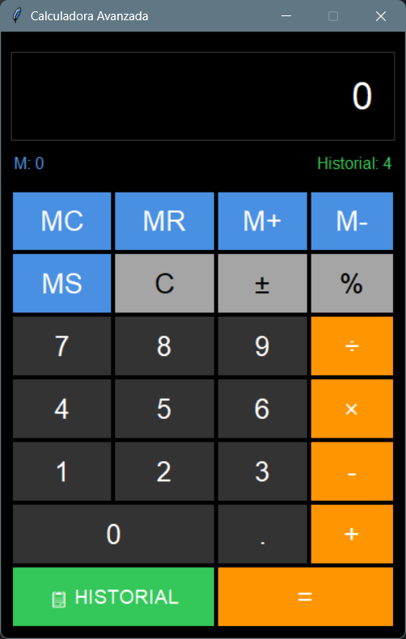
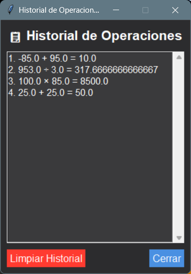

# 🧮 Calculadora Python Avanzada

Una calculadora moderna con interfaz gráfica desarrollada en Python, que simula la experiencia de una calculadora de smartphone con funciones avanzadas.


## ✨ Características

### 🎯 Funcionalidades Principales
- **Operaciones básicas**: Suma, resta, multiplicación y división
- **Memoria completa**: MC, MR, M+, M-, MS
- **Historial persistente**: Guarda las operaciones entre sesiones
- **Funciones adicionales**: Cambio de signo (±), porcentaje (%)

### 🎨 Interfaz de Usuario
- Diseño moderno tipo iOS con tema oscuro
- Botones con colores diferenciados por función
- Display con borde sutil y texto legible
- Distribución intuitiva de botones

### 💾 Persistencia de Datos
- Historial de operaciones se guarda automáticamente
- Memoria persistente entre sesiones
- Archivo JSON para almacenamiento de datos

## 🚀 Instalación y Uso

### Prerrequisitos
- Python 3.6 o superior
- Módulo tkinter (generalmente incluido en Python)

### Ejecución
```bash
# Clonar el repositorio
git clone https://github.com/sercadel/calculadora-python.git
cd calculadora-python

# Ejecutar la calculadora
python calculadora.py
```

## 📸 Capturas de Pantalla





## 🛠️ Estructura del Proyecto
```bash
calculadora-python/
├── calculadora.py              # Código principal
├── README.md                   # Documentación
├── requirements.txt            # Dependencias
├── .gitignore                  # Archivos ignorados
├── LICENSE                     # Licencia del proyecto
└── calculadora_historial.json  # Datos persistentes (generado)
```

## 🔧 Desarrollo

## Tecnologías Utilizadas

    Python 3: Lenguaje de programación

    Tkinter: Para la interfaz gráfica

    JSON: Para persistencia de datos

## Flujo de Desarrollo con Git

### Este proyecto fue desarrollado siguiendo prácticas modernas de Git:

    Ramas feature para nuevas funcionalidades

    Commits semánticos

    Tags para versiones importantes

## 📋 Historial de Versiones
v1.0.0 - Versión Estable

    ✅ Operaciones aritméticas básicas

    ✅ Sistema completo de memoria

    ✅ Historial persistente

    ✅ Interfaz moderna tipo smartphone

    ✅ Persistencia de datos


## 🤝 Contribuir

Las contribuciones son bienvenidas. Por favor:

    Fork el proyecto

    Crea una rama para tu feature (git checkout -b feature/AmazingFeature)

    Commit tus cambios (git commit -m 'Add some AmazingFeature')

    Push a la rama (git push origin feature/AmazingFeature)

    Abre un Pull Request

## 📄 Licencia

Este proyecto está bajo la Licencia MIT - ver el archivo LICENSE para detalles.
## 👨‍💻 Autor

sercadel - [GitHub](https://github.com/sercadel)

## ⭐ Si te gusta este proyecto, ¡dale una estrella en GitHub!